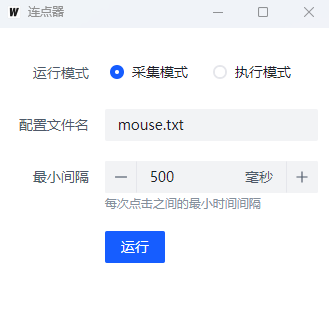

# autoClick
> 游戏背包东西有点多，每次都要点好多次，正好最近在学习Wails，于是就写了这个小工具，可以采集点击轨迹，然后重放轨迹，省去了很多重复的操作。

### 下载

[windwos](https://github.com/zsxl/autoClick/releases/download/v1.0.0/windows-amd64.exe)

## 说明

   

- [x] 采集模式和运行模式（采集模式：采集需要点击的轨迹，运行模式：重放采集好的轨迹）
- [x] 配置文件名（保存采集的行动轨迹的文件名）
- [x] 最小间隔（采集模式下，两次点击轨迹的最小间隔）
- [x] 执行周期（运行模式下，重放轨迹的周期，为0时无限重放）

